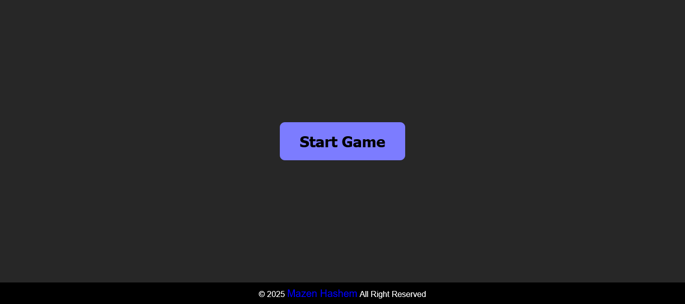
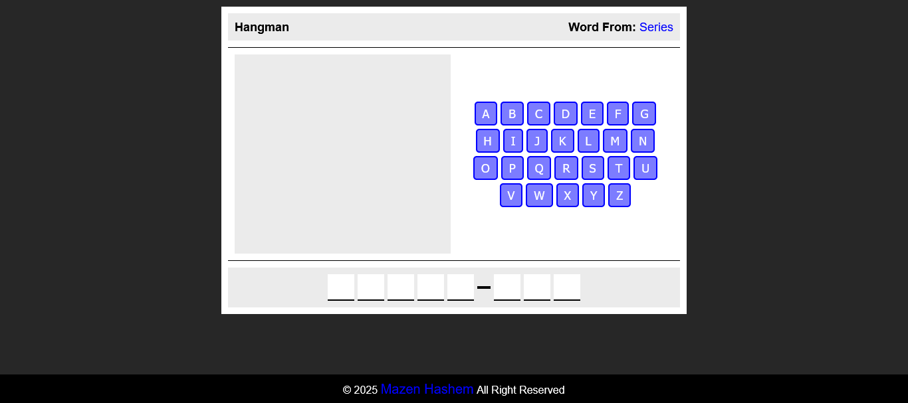
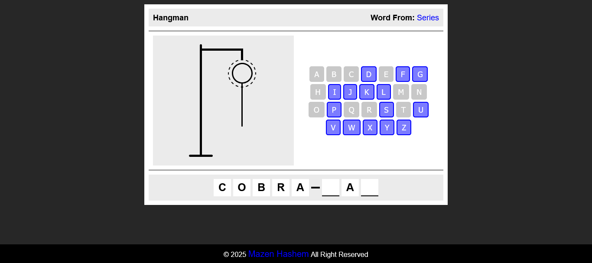
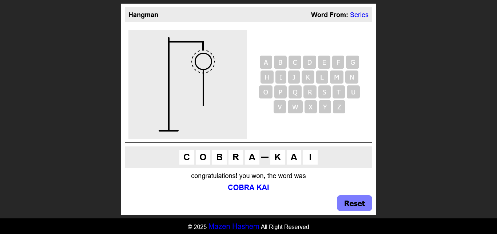
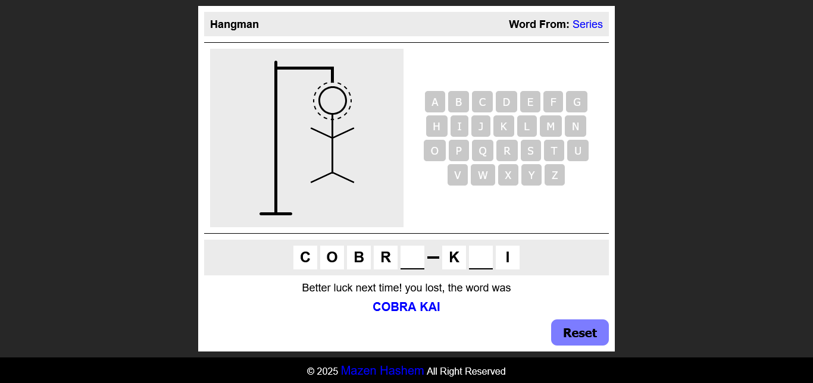

<h1>Hangman game</h1>

  

<h2>Description</h2>

  This is a Hangman game made by 
  <em>HTML</em> , 
  <em>CSS</em> and
  <em>JavaScript</em> languages.
  Inspired by 
  <strong>
    <a href="https://www.youtube.com/@ElzeroWebSchool">ElzeroWebSchool</a>
  </strong> 
  channel.

My goal from this project is to show my experience in Front-end web development.

<h3><u>Functionality:</u></h3>
<h4>On click start:-</h4>
<ul>
  <li>it will fetch game data from local json file.</li>
  <li>After success fetch, one random topic will be chosen from some topics, then one random word will be chosen from handreds of words from this topic.</li>
  <li>Game will create and functionality of buttons will run.</li>
  <li>Player can read the topic of the word.</li>
</ul>
<h4>While playing:-</h4>
<ul>
  <li>Player has 8 peaces to complete hangman image and loss.</li>
  <li>Guess the word of the current topic, then click on the (A-Z) buttons.</li>
  <li>if clicked the right letter: it will appear in the empty boxs, if not: one peace from hangman image will be add until loss.</li>
</ul>

<h3><u>Responsiveness:</u></h3>

  The website is responsive, it created to use across all devices, such as modern desktops, tablets, and phone browsers.

<h2>Screenshot</h2>
<h3><u>Start:</u></h3>

<h3><u>Game box:</u></h3>

<h3><u>Result:</u></h3>
<h4>Wining:-</h4>

<h4>Losing:-</h4>
